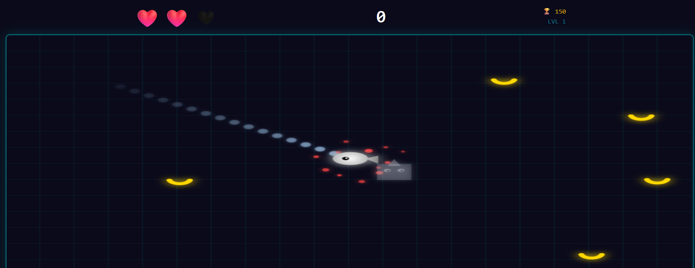
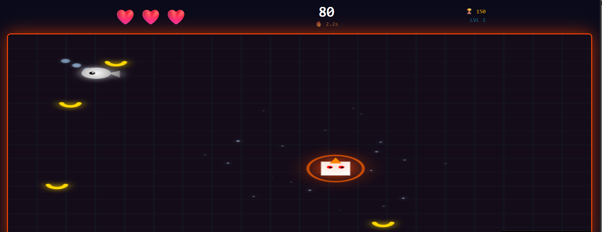

<p align="center">
  
  
  
  
</p>

<h1 align="center">🦏 Rhino Rampage</h1>
<h3 align="center">Neon-Retro 2D Arcade Survival Experience</h3>

<p align="center">
  <b>Master heavy inertia physics, outmaneuver the relentless Mercury Fish, collect power-ups, and trigger intense Rage Mode combat!</b>
</p>

<p align="center">
  <a href="#-gameplay-previews">Previews</a> •
  <a href="#-executive-overview">Overview</a> •
  <a href="#-game-modes">Game Modes</a> •
  <a href="#-core-mechanics--power-ups">Mechanics</a> •
  <a href="#-rage-mode--combos">Rage Mode</a> •
  <a href="#-controls--mobile-support">Controls</a> •
  <a href="#-tech-stack--architecture">Tech Stack</a>
</p>

---

## 🖼️ Gameplay Previews

<p align="center">
  
  
</p>

---

## 🎯 Executive Overview

**Rhino Rampage** is a fast-paced neon-retro 2D arcade game built with **React** and the **HTML5 Canvas API**. 

Players control a heavy Rhino governed by realistic inertia physics—accelerating smoothly and sliding through turns while dodging a liquid-metallic **Mercury Fish** that leaves a slippery trail in its wake. Collect snacks to rack up points, unlock rare sushi power-ups, and smash through enemies in white-hot **Rage Mode**!

---

## 🕹️ Game Modes

| Mode | Visual Identifier | Gameplay Description |
| :--- | :---: | :--- |
| **🔥 Fast Mode** | Dynamic | Full-speed arcade challenge engineered for high-adrenaline players. |
| **🌿 Relaxed Mode** | Chill | Enemies move **40% slower**, providing an easier learning curve and casual gameplay. |

---

## 🧩 Core Mechanics & Power-Ups

| Element | Visual Icon | In-Game Mechanics & Effects |
| :--- | :---: | :--- |
| **🦏 The Rhino (Player)** | Heavy Unit | Player character driven by **inertia physics**. Features realistic acceleration and momentum sliding. |
| **🐟 Mercury Fish (Enemy)** | Hunter | Liquid metallic predator that continuously tracks and hunts down the Rhino. |
| **⚪ Silver Trail** | Hazard | Slippery liquid trail left behind by the fish. Stepping on it causes temporary loss of control. |
| **🍌 Bananas** | Score Item | +10 Points each. Up to **5 bananas** spawn dynamically on screen at a time. |
| **🍣 Sushi** | Power-Up | Rare drop that instantly activates 5 seconds of **Rage Mode**. |

---

## ⚡ Rage Mode & Combat Mechanics

When collecting **Sushi**, the Rhino enters an empowered combat state:

* ⚪ **Visual Transformation:** Rhino glows radiant white with glowing red eyes.
* 🚀 **Speed Doubler:** Movement speed increases by **2x** with enhanced inertia handling.
* 💥 **Smash Counter-Attack:** Direct collisions with the Mercury Fish destroy it for a **+50 Bonus Point** reward!
* ⏱️ **Active HUD Timer:** Real-time countdown timer displayed at the top center HUD.

---

## ❤️ Health & Infinite Difficulty Engine

### 🛡️ Survival & Invincibility
* **3-Heart Life Bar:** Displayed dynamically in the top HUD.
* **Impact Penalty:** Taking a direct hit from the Mercury Fish costs **1 Heart**.
* **Invincibility Frames (i-Frames):** 2 seconds of invincibility upon damage (Rhino flashes to indicate state).
* **Game Over:** Depleting all 3 hearts ends the run.

### 📈 Endless Scaling
* **Dynamic Speed Increases:** The Mercury Fish gains additional speed every **50 points**.
* **No Ceiling:** Scaling difficulty continues indefinitely to test reaction speed and precision steering.

---

## 📱 Controls & Mobile Support

### 🖥️ Desktop (Keyboard Controls)
* **Omnidirectional Steering:** `WASD` or `Arrow Keys`

### 📱 Mobile & Tablet (Virtual Joystick)
* **Touch Interface:** Fully responsive layout scaled for mobile portrait aspect ratios.
* **Virtual Joystick:** Touch the **bottom-left corner** of the canvas to activate fluid analog directional controls.

---

## 🏗️ Tech Stack & Directory Structure

| Layer | Technology | Function |
| :--- | :--- | :--- |
| **Frontend Framework** | React.js | UI State Management, HUD Rendering & Game Modes |
| **Graphics Engine** | HTML5 Canvas API | High-FPS 2D Vector Rendering & Particle FX |
| **Physics System** | Custom Inertia Engine | Momentum calculation, friction drag & velocity vectors |

```
rhino-rampage/
├── assets/
│   ├── 1.png             # Rage Mode combat screenshot
│   └── 2.png             # Mercury Fish chase & HUD preview
└── README.md             # Game documentation & product page
```

---

<p align="center">
  <b>Rhino Rampage</b> — Neon Arcade Chaos Powered by React + Canvas.
</p>
